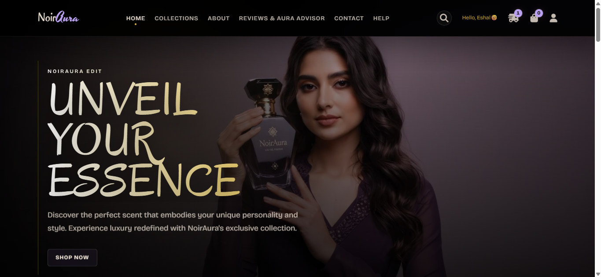
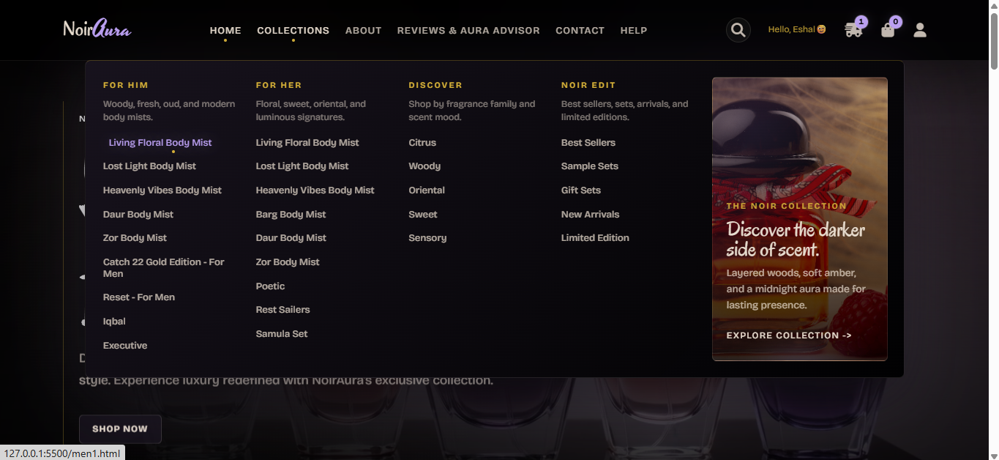
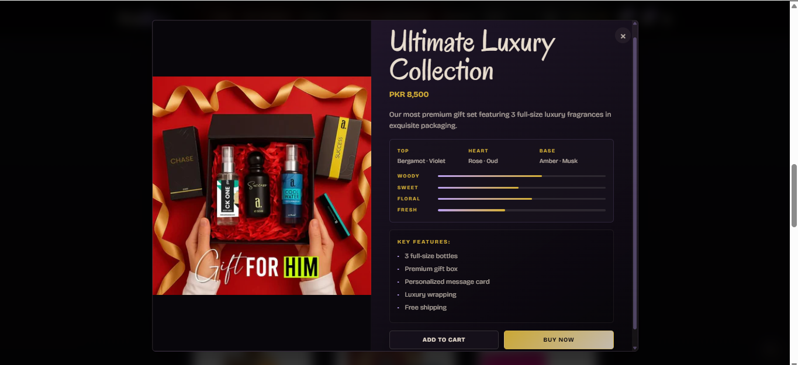
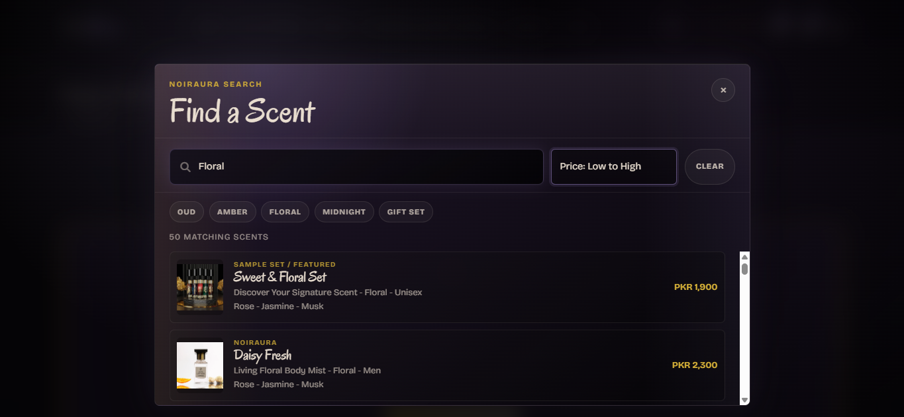
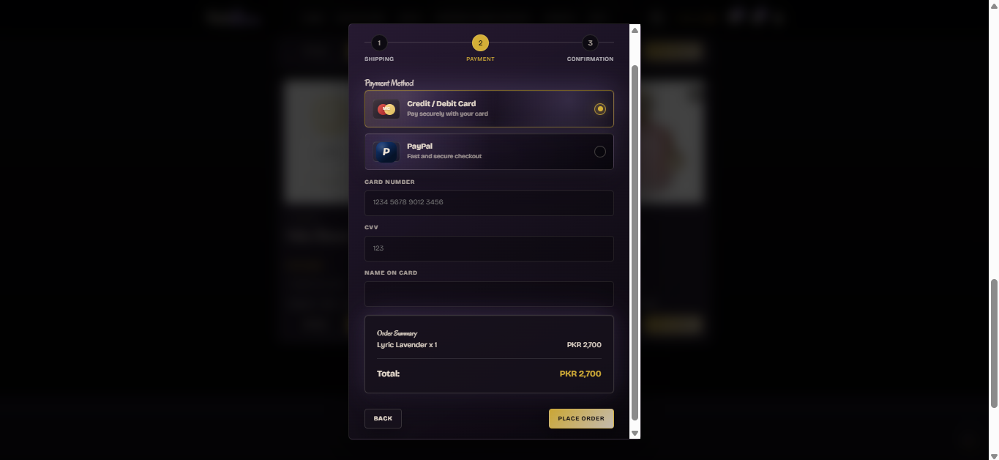
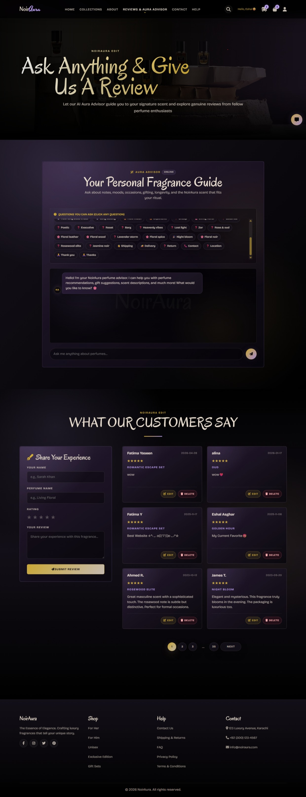
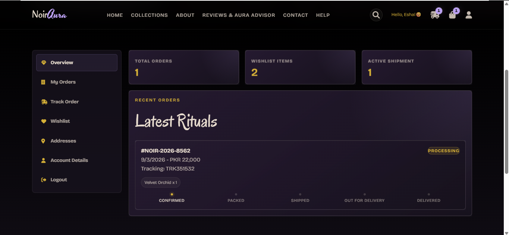
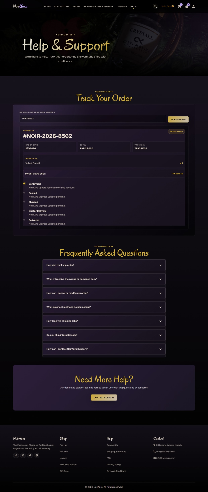

# NoirAura

NoirAura is a luxury perfume e-commerce frontend built as a static HTML, CSS, and JavaScript website. It presents a dark, cinematic fragrance shopping experience with product discovery, user accounts, wishlist and cart flows, checkout, order tracking, customer reviews, and an interactive Aura Advisor.

The project focuses on a premium visual identity: noir black backgrounds, deep plum and smoky mauve surfaces, champagne ivory text, lavender aura glows, restrained gold accents, Oregano headings, Bricolage Grotesque body/UI text, and limited Yesteryear decorative accents.

## Overview

NoirAura is designed as a portfolio-ready storefront experience for browsing fragrance collections, opening detailed product modals, saving products, managing a shopping bag, placing demo orders, and tracking account-specific orders. The site is built without a frontend framework or build system, so it can run directly as a static website.

The core shared behavior lives in:

- `noiraura-luxury.css` for the global luxury design system, responsive polish, card glow effects, modals, navigation, filters, dashboard, checkout, and animations.
- `noiraura-luxury.js` for shared interactions, account routing, user-specific LocalStorage, global search, collection filtering, dashboard rendering, checkout enhancements, order tracking, scroll animations, and global Back to Top behavior.
- `noiraura-products.js` for the global product search/index data.

## Key Highlights

- Cinematic homepage with a local MP4 hero video.
- Full luxury storefront navigation with desktop mega menu and responsive mobile sidebar.
- Global search overlay powered by a static NoirAura product index.
- Product detail modals with fragrance notes and scent profile meters.
- User-specific wishlist, cart, and order data using LocalStorage routing.
- Dashboard for orders, tracking, wishlist, addresses, and profile editing.
- Multi-step demo checkout with shipping, payment, and confirmation steps.
- Premium payment method cards for Credit / Debit Card and PayPal demo flows.
- Help-page order tracking that only reads orders for the logged-in account.
- Reviews page with review submission, edit/delete actions, star ratings, and pagination.
- Interactive Aura Advisor implemented as a guided, scripted frontend fragrance assistant.
- Scroll reveal animations, card glow hover states, responsive product grids, responsive modals, and global Back to Top control.

## Features

### Product Discovery

- Product grids across the homepage and collection pages.
- Product cards with imagery, pricing, action buttons, wishlist buttons, and premium hover glow.
- Product detail modals opened from card actions.
- Fragrance notes grouped into top, heart, and base notes.
- Fragrance character/profile bars generated from product naming and scent family patterns.
- Product deep links using a `?product=` query parameter where supported.

### Navigation

- Shared NoirAura header across the main site and dashboard.
- Desktop Collections mega menu with sections for Men, Women, Type, and Shop By.
- Mobile/tablet navigation sidebar with a Collections accordion.
- Search, account, order, and cart controls in the navbar.
- Active and hover states styled through the shared luxury theme.

### Search, Filters, and Sorting

- Global search overlay with product results from `noiraura-products.js`.
- Search result sorting options:
  - Featured
  - Trending
  - Newest
  - Price: Low to High
  - Price: High to Low
  - Name A-Z
- Collection filter bars on Best Sellers, Sample Sets, Gift Sets, New Arrivals, and Limited Edition pages.
- Filter chips generated from product card data such as family, gender, and tags.
- Price-band filtering with custom responsive dropdowns.
- Desktop dropdown overlays and mobile/tablet bottom-sheet filter controls.

### Accounts and User Data

- Frontend signup and login modals.
- Logout behavior.
- Account greeting in the navbar.
- Dashboard profile editing for name, email, phone, city, postal code, and address.
- Password validation rules in the frontend.
- User-specific LocalStorage routing for cart, wishlist, and orders.
- Legacy session keys are synchronized with the newer account structure for compatibility.

### Wishlist, Cart, and Orders

- Wishlist save/unsave buttons on product cards.
- Wishlist items rendered in the dashboard.
- Shopping bag/cart modal with item quantities, remove actions, count badge, and total.
- Orders modal on shopping pages.
- Order count badge in the navbar.
- Demo order creation with generated NoirAura order IDs, tracking numbers, order dates, totals, status, and estimated delivery.
- Order deletion from the orders modal where that modal is available.

### Checkout Experience

- Multi-step checkout modal:
  - Shipping
  - Payment
  - Confirmation
- Shipping form with name, email, phone, address, city, ZIP code, and country fields.
- Account-aware checkout prefill for saved user details.
- Premium payment method cards for:
  - Credit / Debit Card
  - PayPal
- Card fields are shown for card payment and hidden/disabled for the PayPal demo path.
- Confirmation step displays the generated order ID.

### Reviews and Aura Advisor

- Reviews & Aura Advisor page (`ra.html`).
- Scripted Aura Advisor with clickable question chips and guided fragrance responses.
- Floating advisor shortcut that scrolls to the advisor section.
- Review submission form with name, perfume name, star rating, and review text.
- Review list with consistent review cards.
- Edit and delete review actions.
- Review pagination with a compact page range and ellipses.
- Reviews are stored in LocalStorage in addition to the default seeded review list.

### Help and Tracking

- Help & Support page (`he.html`) with order tracking, FAQs, and support-oriented content.
- Tracking lookup uses the same user-specific order data as the dashboard.
- Logged-in users can only track their own orders.
- Invalid or another user's order ID returns an account-safe "Order not found for this account." style message.
- Tracking timeline follows:
  - Confirmed
  - Packed
  - Shipped
  - Out for Delivery
  - Delivered

### Motion and Visual Polish

- Product/card glow effects in default and hover states.
- Scroll reveal animations using IntersectionObserver.
- Page-specific animation styles for home, about, reviews, contact, help, dashboard, and collection views.
- Reduced-motion support through `prefers-reduced-motion`.
- Global Back to Top button injected/reused across pages.
- New Arrivals and Limited Edition animated promo banners with fixed sizing and scroll hide/show behavior.

## Design System

NoirAura uses a dark luxury visual direction with:

- Noir black page backgrounds.
- Deep plum and smoky mauve panels.
- Champagne ivory text.
- Subtle aura lavender glow.
- Restrained antique gold accents.
- Oregano for headings.
- Bricolage Grotesque for body and interface text.
- Yesteryear only as a limited decorative accent.
- Soft card shadows, thin premium borders, smooth transitions, and cinematic reveal motion.

## Pages

| File | Purpose |
| --- | --- |
| `index.html` | Homepage with hero video, featured products, Find Your Aura section, story content, testimonials, newsletter, product modal, cart, checkout, and account modals. |
| `ab.html` | About page with NoirAura story, philosophy, experience, craftsmanship, and brand sections. |
| `ra.html` | Reviews & Aura Advisor page with guided advisor chat, review form, review cards, edit/delete review modal, and pagination. |
| `co.html` | Contact page with contact content, form flow, and support/social details. |
| `he.html` | Help & Support page with account-scoped order tracking, FAQs, and support content. |
| `dashboard.html` | User dashboard with overview metrics, order history, tracking, wishlist, addresses, account details, profile editing, logout, and cart access. |
| `bestse.html` | Best Sellers collection page. |
| `sam.html` | Sample Sets collection page. |
| `gif.html` | Gift Sets collection page. |
| `new.html` | New Arrivals collection page with animated promo banner. |
| `limi.html` | Limited Edition collection page with animated promo banner. |
| `c.html` | Citrus fragrance family collection. |
| `w.html` | Woody fragrance family collection. |
| `o.html` | Oriental fragrance family collection. |
| `s.html` | Sweet fragrance family collection. |
| `se.html` | Sensory fragrance family collection. |
| `men1.html` | Living Floral Body Mist - For Men collection. |
| `men2.html` | Lost Light Body Mist collection. |
| `men3.html` | Heavenly Vibes Body Mist collection. |
| `men4.html` | Daur Body Mist - For Men collection. |
| `men5.html` | Zor Body Mist collection. |
| `men6.html` | Catch 22 Gold Edition collection. |
| `men7.html` | Reset - For Men collection. |
| `men8.html` | Iqbal - For Men collection. |
| `men9.html` | Executive - For Men collection. |
| `women1.html` | Living Floral Body Mist collection. |
| `women2.html` | Lost Light Body Mist - For Women collection. |
| `women3.html` | Heavenly Vibes Body Mist - For Women collection. |
| `women4.html` | Barg Body Mist - For Women collection. |
| `women5.html` | Daur Body Mist - For Women collection. |
| `women6.html` | Zor Body Mist - For Women collection. |
| `women7.html` | Poetic - For Women collection. |
| `women8.html` | Rest Sailers - For Women collection. |
| `women9.html` | Samula Set - For Women collection. |
| `test.html` | Standalone contact/test page that loads the shared NoirAura assets. |

## Tech Stack

| Technology | Usage |
| --- | --- |
| HTML5 | Static page structure, modals, product grids, dashboard, forms, and checkout markup. |
| CSS3 | Responsive layout, design tokens, animations, card glow, modals, navigation, banners, and dashboard styling. |
| Vanilla JavaScript | Account flows, LocalStorage routing, cart, wishlist, orders, checkout, filters, search, advisor behavior, animations, and dashboard rendering. |
| LocalStorage | Frontend persistence for users, sessions, cart, wishlist, orders, and reviews. |
| Google Fonts | Oregano, Yesteryear, and Bricolage Grotesque. |
| Font Awesome | Navbar, buttons, dashboard, cart, search, review, and UI icons. |
| IntersectionObserver | Scroll-based reveal animations. |
| CSS media queries and matchMedia | Desktop, tablet, and mobile responsive behavior. |

No package manager, bundler, or framework is required for the current project.

## Project Structure

```text
PerfumeWeb/
|-- README.md
|-- index.html
|-- ab.html
|-- ra.html
|-- co.html
|-- he.html
|-- dashboard.html
|-- bestse.html
|-- sam.html
|-- gif.html
|-- new.html
|-- limi.html
|-- c.html
|-- w.html
|-- o.html
|-- s.html
|-- se.html
|-- men1.html ... men9.html
|-- women1.html ... women9.html
|-- test.html
|-- noiraura-luxury.css
|-- noiraura-luxury.js
|-- noiraura-products.js
|-- imgs/
|   |-- Product, collection, hero, contact, about, and page imagery
|-- Video/
|   |-- NoirAura-home-hero-vid.mp4
```

The `imgs/` directory contains the site's visual assets, including WebP product imagery, JPG page imagery, PNG assets, and a small number of AVIF/JPEG files. The `Video/` directory contains the homepage hero video.

## Running Locally

Because NoirAura is a static website, it does not need `npm install` or a build command.

1. Clone or download the repository.
2. Open the project folder in VS Code or another editor.
3. Start a static server. The easiest option is the VS Code Live Server extension.
4. Open `index.html` in the browser through the local server.

Example Live Server URL:

```text
http://127.0.0.1:5500/index.html
```

You can also use any simple static server that serves the project root.

## Frontend and Demo Limitations

NoirAura is a frontend portfolio/demo implementation.

- Authentication is stored in browser LocalStorage and is not production-secure.
- Password handling is implemented on the client for demonstration only.
- Cart, wishlist, reviews, orders, and dashboard data are saved locally in the browser.
- Order tracking reads local account-specific demo orders and does not connect to a courier API.
- Checkout and payment are simulated frontend flows.
- Credit / Debit Card and PayPal options do not process real transactions.
- A production version would need backend authentication, server-side validation, secure password handling, database storage, payment gateway integration, and real order fulfillment APIs.

## Preview

A visual look at the NoirAura luxury fragrance shopping experience.

### Home Experience



### Collections



### Product Details



### Global Search



### Checkout Experience



### Reviews & Aura Advisor



### User Dashboard



### Order Tracking



## Developer

**Developer:** Eshal Noor

- GitHub: [github.com/eshal-000](https://github.com/eshal-000)
- LinkedIn: [linkedin.com/in/eshal-noor-dev](https://www.linkedin.com/in/eshal-noor-dev)
- Email: [eshaldeveloper3@gmail.com](mailto:eshaldeveloper3@gmail.com)
